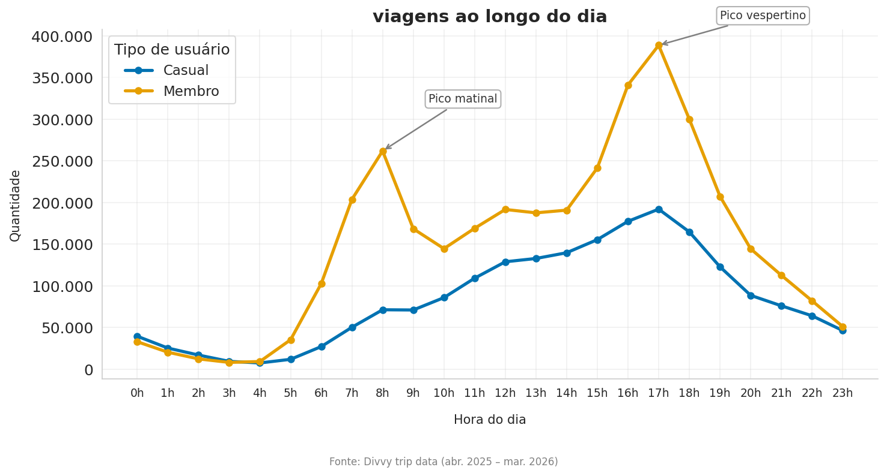
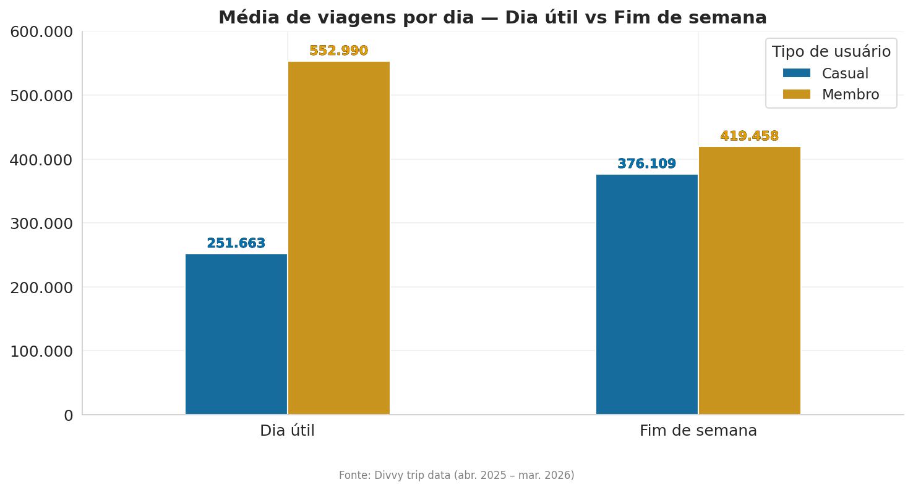
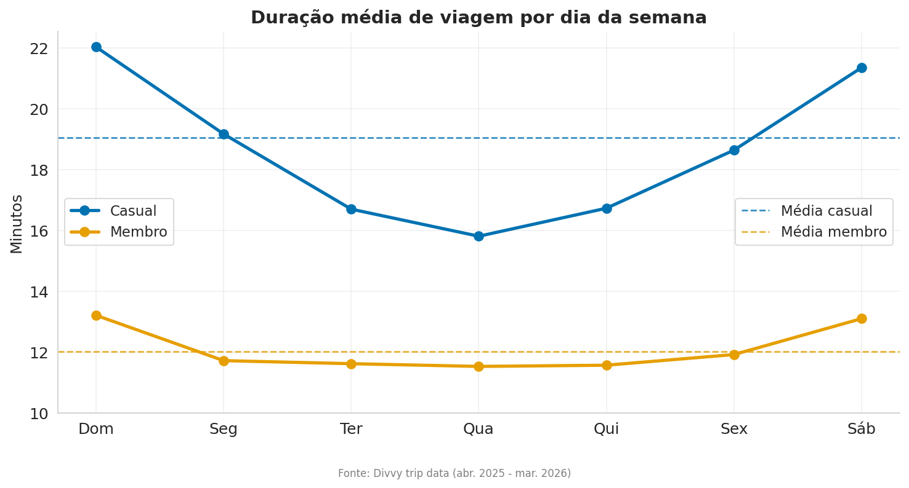
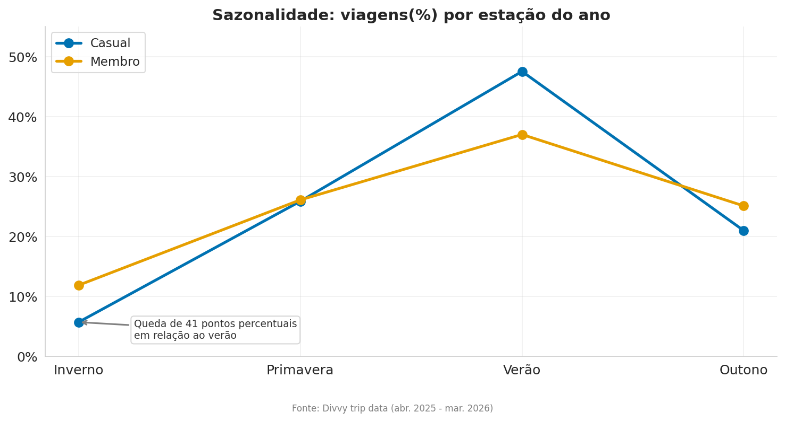
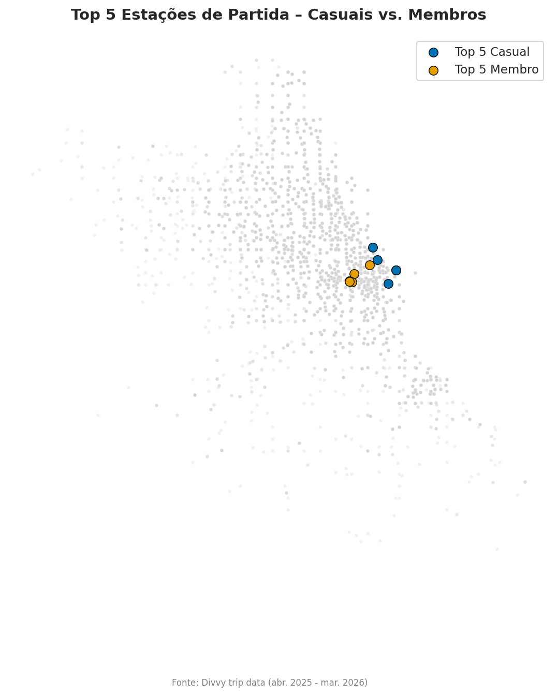

# 🚴 Cyclistic Bike-Share · Análise de Conversão Comportamental
### Entendendo o comportamento de uso para converter usuários casuais em membros anuais


Análise comportamental sobre dados reais da **Divvy**, serviço de bike-share de Chicago.
O objetivo é entender como os dois grupos utilizam o serviço de forma diferente
e derivar estratégias de conversão fundamentadas em padrão de uso.
Período: **abr. 2025 – mar. 2026**.

---

## Contexto de Negócio

Em um serviço de assinatura, receita recorrente tende a ser mais lucrativa (e previsível, portanto estável)
do que uso avulso. A maior oportunidade de crescimento da Cyclistic, 
portanto, não está na aquisição de novos clientes — e sim na conversão dos usuários casuais, 
que já conhecem e utilizam o serviço.

A pergunta central desta análise:  
**Como membros anuais e usuários casuais utilizam o serviço de bike-share de forma diferente?**

A resposta a essa pergunta forma a base analítica de uma estratégia de conversão 
direcionada.

---

## Como obter os dados

Os arquivos CSV não estão incluídos neste repositório por excederem os limites do GitHub. Você tem duas opções para baixar os dados necessários para rodar a análise.

### Opção 1: Download Automático via Script
Para facilitar o setup, disponibilizamos um script Python que baixa todos os arquivos sequencialmente, descompacta os `.csv` e exclui os `.zip` residuais automaticamente.

Basta rodar o seguinte comando na raiz do projeto:
```bash
python scripts/download_data.py
```
O script exibirá uma barra de progresso no terminal e colocará todos os `.csv` diretamente na pasta `data/`.

> **Possíveis problemas com o script automático:**
> Os dados não estão sob nosso controle, sendo hospedados nos servidores da Divvy. Caso a URL pública mude no futuro, o site fique offline, ou o seu próprio firewall bloqueie downloads automatizados no terminal, o script irá acusar erro.  
Se isso acontecer, basta pular para a **Opção 2**.

### Opção 2: Download Manual
Caso o script falhe ou você prefira baixar você mesmo:

**1.** Acesse a fonte pública de dados em: [divvybikes.com/system-data](https://divvybikes.com/system-data).  
**2.** Baixe manualmente os 12 arquivos correspondentes aos meses de **abril de 2025** até **março de 2026**.  
**3.** Descompacte e mova apenas os arquivos `.csv` extraídos para dentro da pasta `data/`:
```text
data/
 ┣ 202504-divvy-tripdata.csv
 ┣ 202505-divvy-tripdata.csv
 ┗ ... (demais meses até 202603-divvy-tripdata.csv)
```

**4.** Crie e ative um ambiente virtual (recomendado):
```bash
python -m venv .venv
#Windows
.venv\Scripts\activate
#Mac/Linux
source .venv/bin/activate
```

**5.** Instale as dependências:
```bash
pip install -r requirements.txt
```

**6.** Abra o Jupyter a partir da **raiz do projeto** e execute os notebooks **nessa ordem**:
```bash
jupyter notebook
```
1. Rode o `notebooks/DataClean.ipynb`.  
2. Em seguida, rode o `notebooks/DataAnalysis.ipynb`.  

O notebook de limpeza gera o arquivo `cyclistic_project.duckdb` dentro da pasta `database/`, que é usado como banco de dados pelo notebook de análise.

---

## Estrutura do Repositório

```
📦 cyclistic_bike-share_analysis
 ┣ 📁 notebooks/
 ┃  ┣ 📓 DataClean.ipynb          #Limpeza dos dados
 ┃  ┣ 📓 DataAnalysis.ipynb       #Análise dos dados
 ┣ 📁 assets/                     #Gráficos utilizados neste README
 ┣ 📁 data/                       #Pasta para os arquivos .CSV
 ┣ 📁 scripts/
 ┃  ┗ 🐍 download_data.py          #Script de download automático dos dados
 ┣ 📄 requirements.txt
 ┗ 📄 README.md
```

---

## A Análise

Para entender o que diferencia os dois grupos, a análise foi estruturada em quatro dimensões comportamentais: **quando** cada grupo utiliza o serviço, **como** utiliza, **em que contexto** (sazonalidade) e **onde** (localização). Cada dimensão acrescenta uma camada à compreensão da diferença fundamental entre os dois grupos.

---

### 1 — Quando utilizam o serviço?



Membros anuais apresentam dois picos claros — às **8h** e às **17h** — alinhados com os horários típicos de entrada e saída do trabalho.
Usuários casuais, por outro lado, mostram um crescimento gradual ao longo do dia sem pico definido, indicando que as viagens não ocorrem por uma obrigatoriedade, e sim para deslocamentos esporádicos.

Quando analisamos os mesmos dados, mas agrupados por dia útil e fim de semana, conseguimos perceber os diferentes padrões de uso que cada grupo tem: Casuais mostram ter preferência por utilizar o serviço aos fins de semana, ao passo que Membros concentram o uso durante os dias úteis.



---

### 2 — Como utilizam o serviço?



Casuais pedalam em média **19,05 minutos por viagem** — duração maior que a média dos membros, de **12,01 minutos**.
A duração média das viagens dos casuais também é maior ao longo da semana, com picos nos fins de semana. Já a duração média das viagens dos membros é mais constante ao longo da semana.

Como a duração das viagens tende a ter o que chamamos de "cauda longa" — poucas viagens muito extensas podem elevar a média — também foi analisada a mediana. Mesmo por essa métrica, casuais continuam fazendo viagens mais longas: **11,34 minutos** contra **8,58 minutos** dos membros.

A mediana reduz a diferença observada pela média, indicando que parte da média dos casuais é ampliada por viagens longas. Ainda assim, a direção do padrão permanece: a viagem típica casual continua sendo mais longa que a viagem típica dos membros.

Esse padrão aponta para uma diferença comportamental clara:
- **Membros** utilizam o serviço para viagens curtas e constantes — com picos de uso em horários fixos.
- **Casuais** utilizam o serviço para viagens mais longas e esporádicas — com aumento de uso ao longo do dia e maior concentração nos fins de semana.

---

### 3 — Em que contexto utilizam o serviço?



Ambos os grupos reduzem o uso no inverno, mas a queda proporcional é muito mais acentuada entre os casuais:

| Grupo | Participação no verão | Participação no inverno | Queda |
|---|---|---|---|
| **Casual** | 47,51% | 5,69% | **41,8 pontos percentuais** |
| **Membro** | 36,99% | 11,85% | **25 pontos percentuais** |

Casuais são altamente sensíveis às variações climáticas — coerente com um uso voltado ao lazer, que é mais afetado pelo clima. Membros aparentam estar mais alheios a tais variações.

### 4 — Onde utilizam o serviço?



Com esse heatmap nós conseguimos observar bem melhor de onde parte a maioria das viagens de cada grupo.  
As estações de maior partida dos usuários casuais estão todas na orla, no que chamamos de **Lakefront** de Chicago: parques, praias e atrações turísticas.  
Por outro lado, os membros partem mais de "dentro" da cidade, o que chamamos de **Downtown**: área de maior densidade urbana e comercial da cidade.

| Região | Top 5 estações de partida (casuais) | Top 5 estações de partida (membros) |
|---|---|---|
| **Lakefront** | DuSable Lake Shore Dr & Monroe St, Navy Pier, Michigan Ave & Oak St, Streeter Dr & Grand Ave, DuSable Lake Shore Dr & North Blvd | - |
| **Downtown** | - | Kingsbury St & Kinzie St, Clinton St & Washington Blvd, Canal St & Madison St, Clinton St & Madison St, State St & Chicago Ave |

### O que não diferencia os grupos

A preferência por tipo de bicicleta foi testada como possível variável diferenciadora. A distribuição é essencialmente idêntica entre os grupos, com cerca de **65% de bicicletas elétricas e 34% de bicicletas clássicas** em ambos os casos.  
Tipo de bicicleta não é um fator de diferenciação comportamental entre casuais e membros.

---

## Conclusão

As quatro dimensões convergem para uma mesma direção:

| Dimensão | Membros | Casuais |
|---|---|---|
| **Quando** | Dias úteis · picos às 8h e 17h | Fins de semana · crescimento gradual ao longo do dia |
| **Como** | viagens curtas e recorrentes | viagens mais longas e esporádicas |
| **Contexto** | Queda moderada no inverno | Queda acentuada no inverno |
| **Onde** | Downtown · área de maior densidade urbana e comercial da cidade | Lakefront · parques, praias e atrações turísticas |

**A diferença fundamental entre os grupos parece estar no contexto e no propósito da viagem.**  
Membros apresentam padrões compatíveis com deslocamentos rotineiros.  
Casuais apresentam padrões mais compatíveis com uso recreativo e de lazer.  


---

## Recomendações

Com base na análise, três estratégias de conversão foram propostas ao time de marketing:
	

**1 — Campanhas de conversão orientadas pelo comportamento natural do usuário casual**
*Baseada em:* Usuários casuais já são clientes ativos — não são prospects frios. Seu uso se concentra em estações específicas no Lakefront e percorrem em média 19 minutos por viagem, indicando alto engajamento quando utilizam o serviço. A barreira não é desconhecimento — é a ausência de um incentivo que torne a conversão financeiramente racional.
A Cyclistic deve lançar campanhas concentradas fisicamente nas estações de maior volume casual, com um mecanismo de desconto progressivo vinculado à frequência de uso. Cada corrida acumula crédito em direção a um desconto na adesão ao plano anual. O usuário não precisa mudar seu comportamento — é recompensado exatamente pelo que já faz.

**2 — Oferta de planos flexíveis (sazonais)**
*Baseada em:* Casuais concentram 47,51% das viagens no verão e apenas 5,69% no inverno — queda de 41,8 pontos percentuais. O plano anual exige pagamento por 12 meses, mas o casual usa ativamente o serviço por aproximadamente 8 ou 9. Frente aos passes avulsos, assinar anualmente não é uma decisão financeiramente racional.
A Cyclistic deve criar modalidades de plano com duração flexível cobrindo Primavera, Verão e Outono. Esse produto não substitui o plano anual — cria uma escada de valor em direção a ele. A barreira do inverno é removida e a decisão de assinar deixa de ser um risco financeiro para se tornar algo racionalmente justificável.

**3 — Conversão digital no momento de maior engajamento**
*Baseada em:* Casuais concentram 47,51% das viagens no verão e 59,91% da média diária nos fins de semana. O casual de verão, no fim de semana, no Lakefront, é o casual mais engajado com o serviço. A barreira à conversão não é falta de experiência com o produto — é a ausência de um gatilho no momento certo.
A Cyclistic deve explorar o canal do aplicativo para apresentar a proposta de valor da assinatura com base no histórico real de uso de cada usuário. Durante ou após uma corrida nesse período, o app pode mostrar quanto o usuário já gastou em passes avulsos na temporada e quanto teria pago com um plano. O argumento é pessoal, imediato e baseado no próprio comportamento do casual.  

> As recomendações acima são orientadas por padrões de uso e devem ser validadas com dados financeiros internos, como margem por plano, custo de aquisição, taxa de conversão e valor vitalício do cliente.  

---

## 🛠️ Ferramentas e Tecnologias

| Ferramenta | Uso |
|---|---|
| **DuckDB** | Banco de dados analítico embutido (OLAP) — consultas SQL eficientes sobre grandes volumes de dados, sem servidor dedicado |
| **Pandas** | Manipulação de DataFrames e formatação de resultados |
| **Matplotlib + Seaborn** | Visualização de dados |
| **Jupyter Notebook** | Documentação e reprodutibilidade da análise |
| **Python** | Desenvolvimento end-to-end |

---

<p align="center">
	<sub>Fonte dos dados: <a href="https://divvybikes.com/system-data">Divvy trip data</a> 
	abr. 2025 – mar. 2026 · Motivate International Inc. sob licença pública.</sub> 
	<br> 
    <sub>Projeto desenvolvido como parte do 
    <a href="https://grow.google/certificates/data-analytics/">Google Data Analytics Professional Certificate</a>.</sub>
</p>
